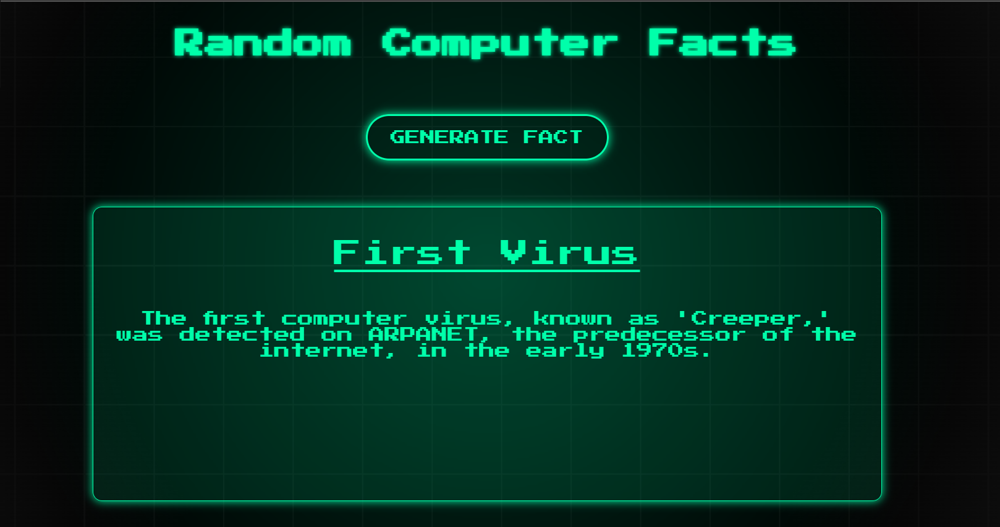

<div align="center">
    
# Computers Fun Fact Generator
***A retro-themed random fun fact generator about computers.***
</div>

Computers Fun Fact Generator is a **HTML/CSS/JavaScript-based web app** that generates random, fun facts about the history and technology of computers. It provides **retro-styled visuals**, **animated backgrounds**, and a **responsive design**. This makes it fun and useful for **learners, tech enthusiasts, and trivia lovers**.

---

<div align="center">


</div>

---

## Table of Contents

- [Computers Fun Fact Generator](#computers-fun-fact-generator)
  - [Table of Contents](#table-of-contents)
  - [Features](#features)
  - [Installation / Setup](#installation--setup)
  - [Usage](#usage)
    - [General User](#general-user)
    - [Developer](#developer)
  - [Screenshots / Demo](#screenshots--demo)
  - [Project Structure](#project-structure)
  - [Configuration](#configuration)
  - [Contributing Guidelines](#contributing-guidelines)
  - [Roadmap](#roadmap)
  - [Built With / Tech Stack](#built-with--tech-stack)
  - [Acknowledgements](#acknowledgements)
  - [License](#license)

## Features

* 🎲 <u>**Random Fun Facts**</u> – Generates a new computer fact every click.  
* 🕹 <u>**Retro Pixelated Theme**</u> – Styled with pixel fonts and glowing neon.  
* 🌐 <u>**Responsive Design**</u> – Works smoothly on desktop & mobile.  
* 🌀 <u>**Animated Grid Background**</u> – Adds a dynamic retro computer vibe.  
* ✨ <u>**Interactive UI**</u> – Simple button-driven interaction.  

## Installation / Setup

**Prerequisites:**

* A modern web browser (Chrome, Firefox, Edge, etc.)

**Steps for Installation:**

```bash
# Clone repository
git clone <Link Path>
cd Computers-Fun-Fact
````

Then open `index.html` in your browser:

```bash
open index.html   # macOS
start index.html  # Windows
```

## Usage

### General User

1. Open `index.html` in your browser.
2. Click **Generate Fact**.
3. Enjoy a random computer fun fact every time!

### Developer

```bash
# Run with a local dev server for auto reload
npx live-server
```

* Edit `script.js` to add or modify fun facts.
* Customize `style.css` for new themes.

## Screenshots / Demo

<div align="center">

</div>  

## Project Structure

```
/public          -> assets (logo, images)
index.html       -> main webpage
style.css        -> retro styling + animations
script.js        -> fact generator logic
```

## Configuration

* No extra configuration needed.
* Optional: Update `script.js` to add custom fun facts.

## Contributing Guidelines

1. Fork the repository.
2. Create a feature branch (`git checkout -b feature-name`).
3. Commit changes (`git commit -m "Add feature"`).
4. Push to branch (`git push origin feature-name`).
5. Open a Pull Request.

## Roadmap

* [ ] Add **sound effects** for button clicks.
* [ ] Add **categories** (hardware, software, history).
* [ ] Add **share button** for social media.
* [ ] Expand **fact database**.

## Built With / Tech Stack

| Component    | Purpose                              |
| ------------ | ------------------------------------ |
| HTML         | Structure of the webpage             |
| CSS          | Styling, animations, retro theme     |
| JavaScript   | Fact generation logic, interactivity |
| Google Fonts | Retro `Press Start 2P` pixel font    |

## Acknowledgements

* Thanks to **Google Fonts** for the `Press Start 2P` retro typeface.
* Inspired by classic **computer trivia and retro games**.

## License

Computers Fun Fact Generator is licensed under the [MIT License](LICENSE).