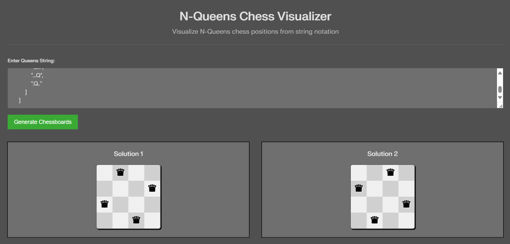

# N Queen Viz
A simple and interactive chessboard visualizer for the N-Queens problem from LeetCode.
Just enter your solution (the array representing queen positions), and the app instantly renders a beautiful chessboard showing where each queen is placed — no more imagining the board in your head!

## Example
```text
[
        [
            ".Q..",
            "...Q",
            "Q...",
            "..Q."
        ],
        [
            "..Q.",
            "Q...",
            "...Q",
            ".Q.."
        ]
    ]
```


## Website link
[Link - nqueens-boardgen.netlify.app](https://nqueens-boardgen.netlify.app/)
